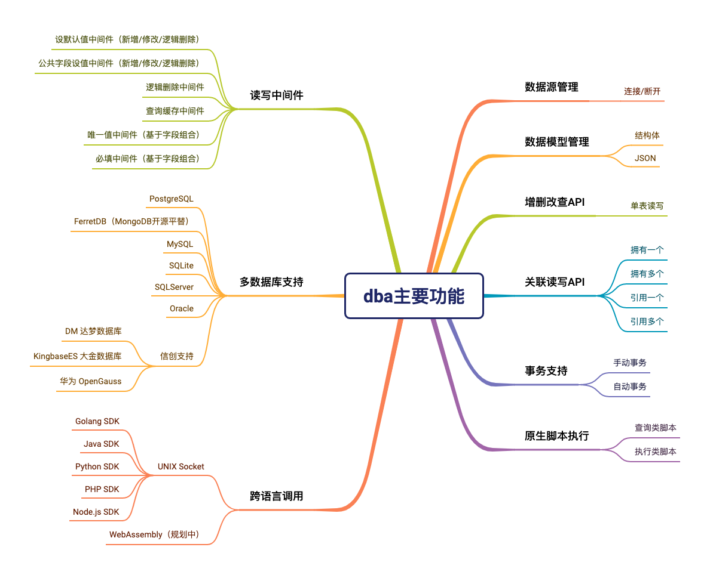
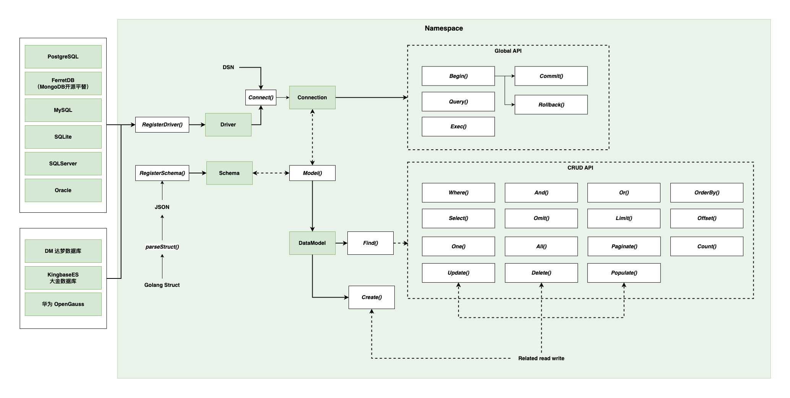

# dba

## 数据库驱动

Go Wiki: SQL Database Drivers
https://go.dev/wiki/SQLDrivers

1. [PostgreSQL](https://github.com/jackc/pgx)
1. [FerretDB（MongoDB开源平替）](https://github.com/FerretDB/FerretDB)
1. [MySQL](https://github.com/go-sql-driver/mysql)
1. [SQLite](https://github.com/mattn/go-sqlite3)
1. [SQLServer](https://github.com/microsoft/go-mssqldb)
1. [Oracle](https://github.com/sijms/go-ora)

## 主要功能

### 主要架构

